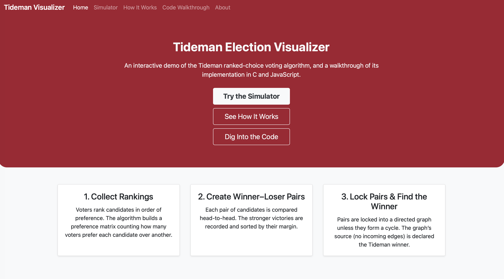
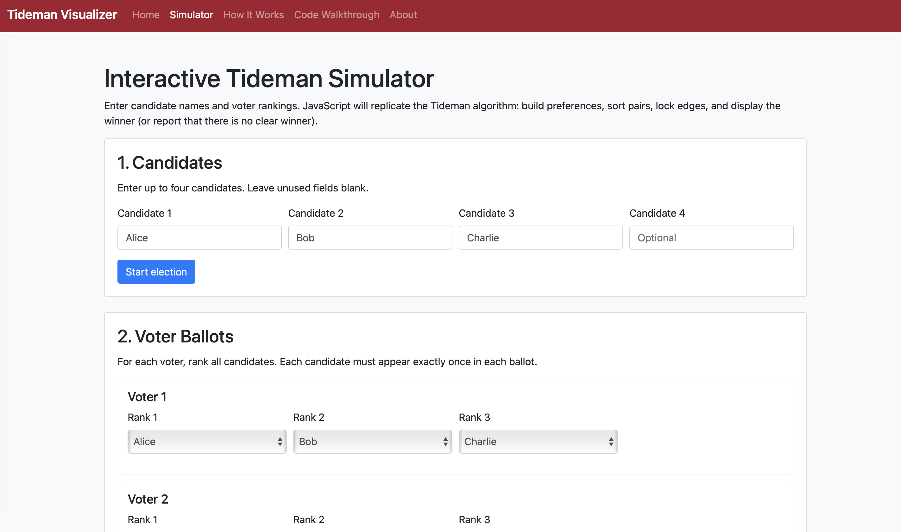
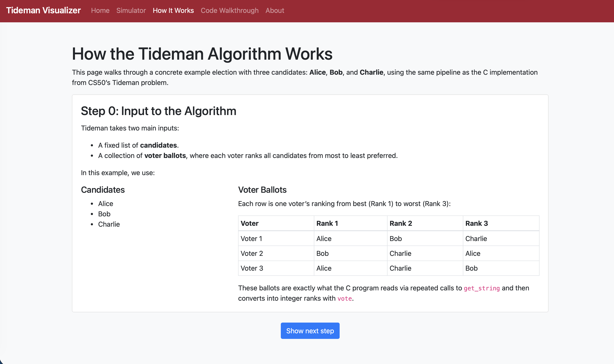
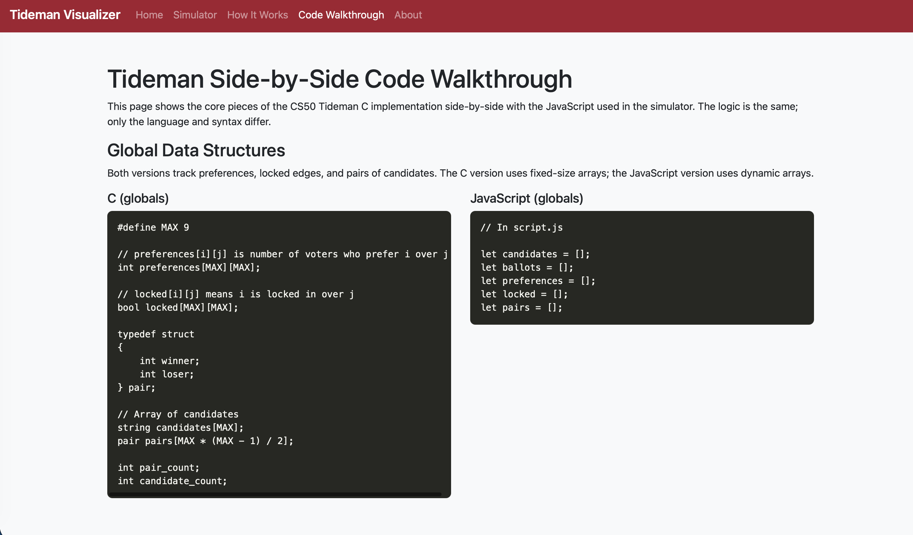

# Tideman Election Visualizer

An interactive website (live on the web [here](https://swiftlynoah.github.io/TidemanVisualizer/index.html)) that demonstrates how the Tideman ranked-choice voting algorithm (also known as the Ranked Pairs method) works.
Built for CS50 2025, Problem Set 8, by Noah Brauner

---

## Overview

This project visualizes the **Tideman algorithm**, a ranked-choice voting method where voters rank candidates by preference.
The algorithm records pairwise victories, sorts them by strength, locks them in without creating cycles, and determines the winner.

The site is designed to make this logic intuitive and accessible. It combines the original C implementation from CS50 with a JavaScript-based simulator and explanatory visuals.

---

## Features

- **Interactive simulator** – Input candidates and voters to see preferences, sorted pairs, and the locked graph
- **Algorithm walkthrough** – Step-by-step visual explanation of the Tideman process
- **Side-by-side code comparison** – Original C implementation vs. JavaScript translation
- **Responsive design** – Fully mobile-friendly using Bootstrap

## Credits

- The C implementation of the Tideman algorithm is identical to the version I submitted for CS50 Problem Set 3
- The web visualizer and simulator were built afterward using JavaScript and Bootstrap.
- Inspired by the Harvard CS50 curriculum.

## Learn More

- [Ranked-choice voting (Wikipedia)](https://en.wikipedia.org/wiki/Ranked_voting)
- [Tideman / Ranked Pairs method (Wikipedia)](https://en.wikipedia.org/wiki/Ranked_pairs)

---

## Contributions

Contributions and suggestions are welcome!
Feel free to fork the repo, submit issues, and open pull requests.

